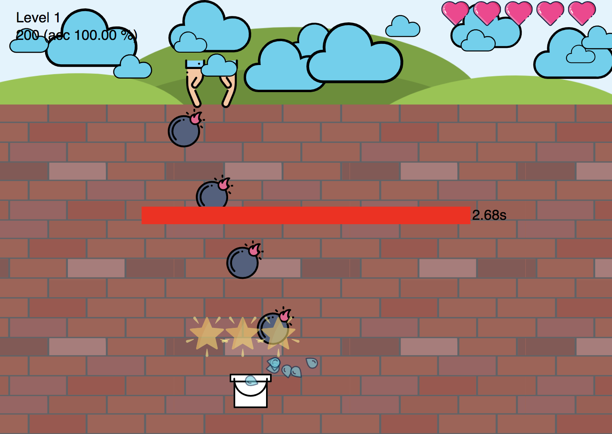

# About
The purpose of this project was to bring back 15-years-old memories. I once made a game for some contest which included so called "clicker" games - games made in `The Games Factory` (currently under brand of `Multimedia Fusion` (https://www.clickteam.com/clickteam-fusion-2-5))

I was strongly inspired by [@mhagmajer](https://twitter.com/mhagmajer) and his Lighting talk during [WarsawJS](https://warsawjs.com) to write this one in React.

# About the Game
You are a kind of policeman with bucket filled with water. Bad guy (prisoner) wants to escape - thus he is dropping bombs in order to destroy the wall. Are you REACTive enough to stop him?

# How to play
Game does not support mobile yet - mouse only. Game consists of 6 levels, starting very slowly but becoming desperate later on.
You can catch bonus (double score) to prove others you are better than them. No more bonuses yet :(

# Game online
https://kgajowy.github.io/bomber/

# ~TODOS before beta-release~

- [x] bonus configurable active time
- [x] bonus activity timer (shrinking horizontal bar?)
- [x] unify/fuse rules related to A) movements B) spawns ~C) destroys~ [refactor]
- [x] background & misc graphics ?
- [x] shake effect on bomb explosion
- [x] think of some nice effect for collecting the bonus
- [x] rain drops when catching bombs
- [x] remove both rain drops and stars when opacity is 0
- [x] ~10~ 6 levels
- [x] menu
- [x] fix: replace screenX with something more suitable
- [x] blog post about progress

## TODOs in social / after beta-release
- [ ] list of in-game features
- [ ] create promo materials
- [ ] blog-post

# TODOs for v.1.1
- [ ] user levels (cpy paste)
- [ ] contributors levels

# TODOs for v.1.2
- [ ] additional bonuses (lifes, enlarge bucket)
- [ ] achievements / gamification example
